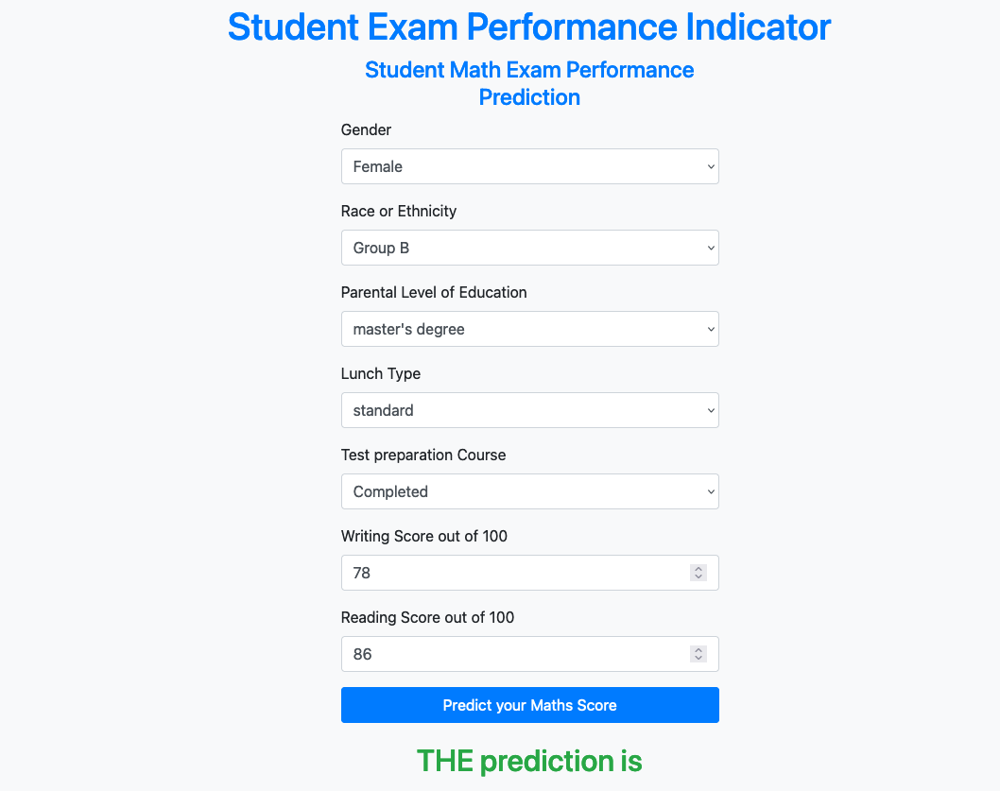

# Student Exam Performance Predictor



## Overview

This project aims to predict the math exam performance of students based on various demographic and academic factors. The predictive model is built using machine learning techniques, and the application features a user-friendly web interface for inputting student information and obtaining predictions.

## Features

- **User-Friendly UI:** An intuitive web interface allows users to input student details, including gender, ethnicity, parental education, lunch type, test preparation course, reading score, and writing score.

- **Predictive Modeling:** The underlying predictive model utilizes machine learning algorithms to provide accurate predictions of math exam scores.

## Getting Started

### Prerequisites

- Python 3.11.x
- Dependencies listed in `requirements.txt`

### Installation

1. Clone the repository:

   ```bash
   git clone https://github.com/SumeetChougule/student-exam-predictor.git

2. Navigate to the project directory:

    ```bash
    cd student-exam-predictor

3. Install dependencies:
   
    ```bash
   pip install -r requirements.txt


### Usage

1. Run the application:

    ```bash
    python application.py

2. Access the web interface at http://localhost:5001 in your browser.


### Deployment

The project is designed to be deployed on cloud platforms such as AWS or Azure. Ensure proper configuration for scalability, security, and accessibility.

### Contributing

Contributions are welcome! Feel free to open issues or submit pull requests.

### License

This project is licensed under the MIT License.

### Acknowledgments

    Bootstrap for the user interface styling.
    Flask for the web application framework.
    Scikit-learn for machine learning functionality.
